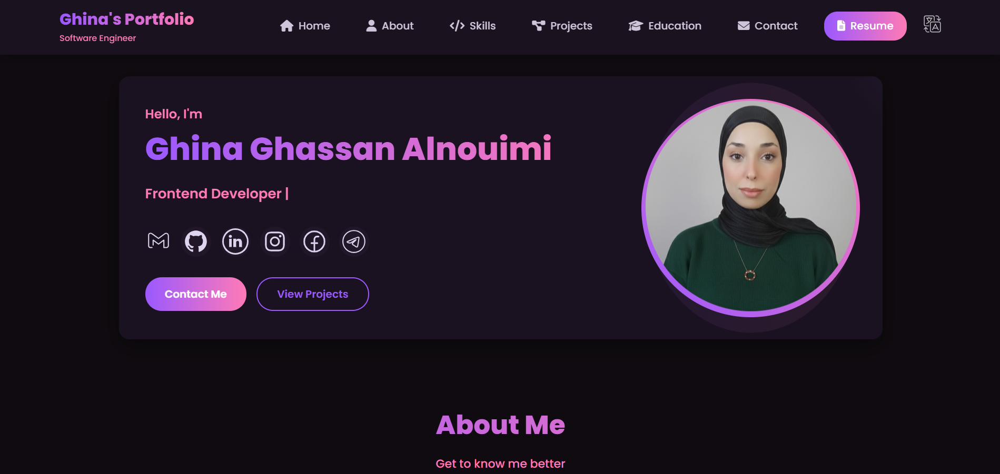
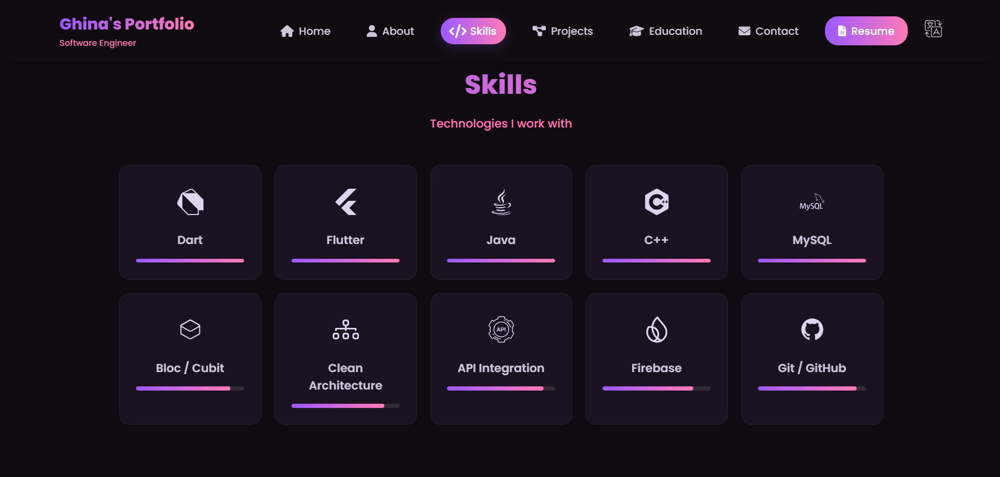
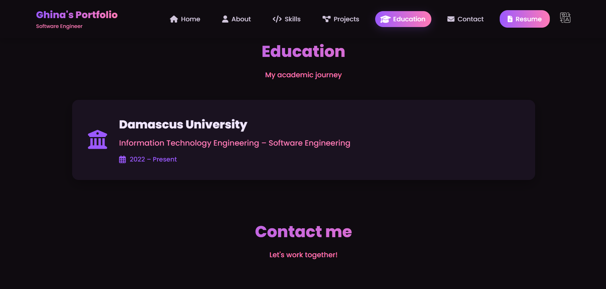

# 🌐 Ghina Alnouimi – Personal Developer Portfolio Website

Welcome to my personal developer portfolio – a responsive, lightweight, and modern website created using **HTML5, CSS3, and JavaScript**. 

> 📍 **Live Portfolio Website:** [https://ghinano.github.io](https://ghinano.github.io)

---

## 🔎 What is This?

This is my **personal portfolio website** designed to showcase my journey as a Flutter developer and Software Engineering student. The site is ideal for:
- Presenting my Flutter mobile applications and projects
- Creating an online resume and professional presence
- Increasing visibility for internship and job opportunities
- Sharing my work with the developer community

As a fifth-year Software Engineering student with 2+ years of Flutter experience, this portfolio represents my passion for mobile development and clean software engineering.

---

## ✨ Highlights & Features

This portfolio includes several optimized sections that highlight my **technical capabilities**:

### 🧑‍💻 About Me
- Professional introduction and academic background
- Career objectives in software engineering
- Contact information and social links

### 🛠️ Skills Section
- Mobile Development (Flutter, Dart)
- State Management (Bloc/Cubit)
- Backend Integration (Firebase, REST APIs)
- Tools & Practices (Git, Github, Clean Architecture, Responsive UI)

### 🚀 Project Showcase
- Featured Flutter projects with:
    - GitHub repository links
    - Technologies used
    - Key features and descriptions

### 🎓 Education & Academics
- Current studies at Damascus University
- Information Technology Engineering specialization
- Software Engineering focus

### 📞 Contact Section
- Professional contact information
- Social media and GitHub links
- Interactive contact form
- Location details

### 📱 Bilingual & Responsive Design
- Full Arabic/English language support
- Works perfectly on all devices
- Modern dark theme with smooth animations

---

## 🧰 Tech Stack Overview

| Technology | Purpose |
|------------|---------|
| **HTML5** | Page structure and semantic markup |
| **CSS3** | Custom styling, animations, and responsiveness |
| **JavaScript** | Interactive features and bilingual functionality |
| **Git/GitHub** | Version control and portfolio hosting |

---

## 📸 Screenshot Showcase

Below are screenshots from my live portfolio website.

<div align="center">
  <table>
    <tr>
      <td align="center">
        <br>
        <b>🏠 Home Page</b>
      </td>
      <td align="center">
        <br>
        <b>🧑‍💻 About Me</b>
      </td>
      <td align="center">
        <br>
        <b>🚀 Projects</b>
      </td>
    </tr>
    <tr>
      <td align="center">
        <br>
        <b>🛠️ Skills</b>
      </td>
      <td align="center">
        <br>
        <b>🎓 Education</b>
      </td>
      <td align="center">
        <br>
        <b>📞 Contact</b>
      </td>
    </tr>
  </table>
</div>

---

## 🚀 Getting Started

### ✅ View Live Portfolio
Visit: [https://ghinano.github.io](https://ghinano.github.io)

### 🔧 Run Locally
```bash
# Clone the repository
git clone https://github.com/GhinaNo/ghinano.github.io.git

# Open the project
cd ghinano.github.io

# Open in browser or use local server
python -m http.server 8000